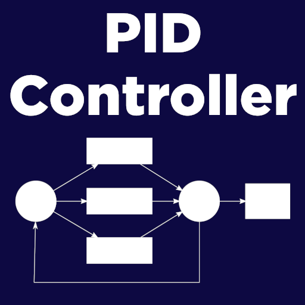

A PID (Proportional, Integral, Derivative) Controller is a type of closed feedback loop that uses an algorithm to get an output that gets to the desired position quickly, doesn't overshoot, and can resist transient errors.


PID was created for applications such as heating (to get to a desired temperature), robotics (getting a motor to a specific velocity), and cruise control for a car. The **set point** of a PID controller is the value you want to achieve, and the **process value** is the value read from the environment. **PID gains** are the constant values to tweak the reactions of the system (kP, kI, and kD). For a more in depth explanation of PID, see [this](https://youtube.com/playlist?list=PLn8PRpmsu08pQBgjxYFXSsODEF3Jqmm-y) YouTube series. 

RoPID implements the PID algorithm (plus a few extra features) into Roblox! It can be used for custom BodyGyros, BodyPositions, and BodyVelocities, as well as, you guessed it, cruise control for your cars or even as dynamic GUI animations. 

## Examples
Ball rolling with a constant velocity (uses base RoPID module)


GUI frame following mouse, but with dynamic movement (uses Vec2 Util module)


Ball following goal part (uses Vec3 util module)


## Installation
- Get the  [Roblox Model](https://www.roblox.com/library/6607300586/RoPID)  and put it wherever you want (ReplicatedStorage recommended)
- Go to the [GitHub Repo](https://github.com/B-Ricey763/RoPID/) and either download the zip or add a git submodule, then sync the `src` directory into your place using a tool like [Rojo](https://rojo.space/docs/)

## How to use
First require the module and create a new controller.
```lua
local RoPID = require(game:GetService("ReplicatedStorage").RoPID)

local goal = -- Some number as the goal for the controller

local controller = RoPID.new(10, 4, 3.5, -1000, 1000) -- Some typical gains
```
Then you must call the `Calculate()` method to update the controller and get your result. You could do it in a loop, but it is recommended to use `RunService` and connect to the `Stepped` or `Heartbeat` event.
```lua
game:GetService("RunService").Stepped:Connect(function(elaspedTime, deltaTime)
  local proccessValue = -- Value to be read from game
  local output = controller:Calculate(goal, proccessValue, deltaTime) -- Don't forget the delta time parameter!
end)
```
You can use your output variable to change the force of a `VectorForce` or maybe a position of a GUI. 

## Utility
Along with the base PID module, there are a few extra utility modules that provide extra features. You can access these modules like so:
```lua
local RoPID = require(game:GetService("ReplicatedStorage").RoPID)
local utilModule = require(RoPID.Util.[moduleName])
```

### Tuner
- The hardest part about PID is tuning the gains, so this module provides an easy to use interface to do so
- Creates a folder in your workspace with attributes assigned to each gain in your controller 
- You can change the attributes during runtime to experiment with different gains

### Vec2 and Vec3 
- In Roblox games it is common to deal with `Vector2`s and `Vector3`s
- These vector modules create a PID controller for each axis (X, Y, Z) with the same gains
- Useful for things like custom BodyPositions or Gui controllers

*This module is heavily inspired by [AeroGameFramework's PID module](https://github.com/Sleitnick/AeroGameFramework/blob/43e4e02717e36ac83c820abc4461fb8afa2cd967/src/StarterPlayer/StarterPlayerScripts/Aero/Modules/PID.lua)*
